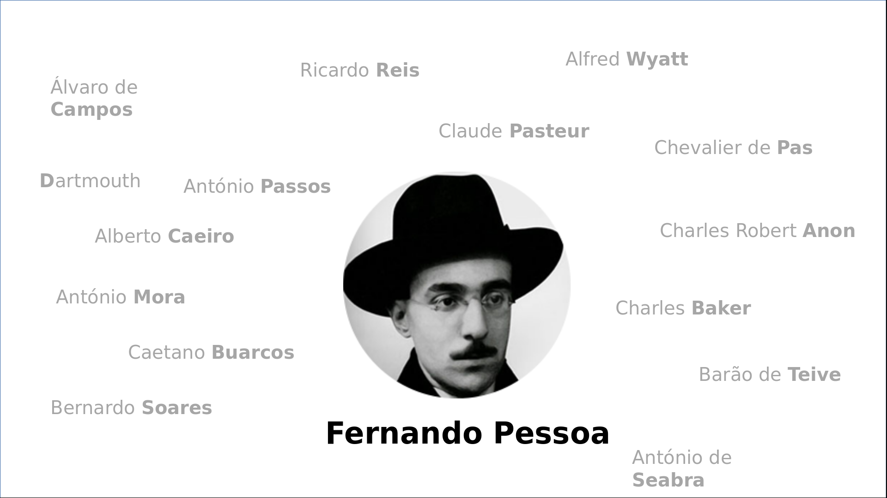

<!-- $size: 16:9 -->
<!-- page_number: false -->

### Compartmentalization

Dividing our digital life to increase privacy

<!-- Creative Commons Attribution-ShareAlike -->

---

# 
Sharing is Caring 

Please copy, share, and remix!

grab a copy of the presentation: 
  
[github.com/francisco-core/presentation-compartmentalization](https://github.com/francisco-core/presentation-compartmentalization)
###### speaker notes included

<!-- Creative Commons Attribution-ShareAlike -->&nbsp;  This presentation is under the Creative Commons Attribution-ShareAlike License

--- ---

#### What is
### compartmenalization?

notes:
  - let's start off with a simple question: Why do we have rooms in
    our house?

---

### Definition

notes:

  Very generically, compartmentalization is when we a big thing is
  divided into little thing for one reason or another. But this
  definition doesn't help us much. So let's look at some examples.
  
  Do you think we always behave the same? Or does it depend on the
  context?
  
  For example, the "us" in our profession is different from the "us"
  with our family, which migh in turn be different from the "us" with
  our closest friends. Things that we relveal in one context may not
  be appropiate or even desired in other contexts. So for that reason
  we have many versions of our personality. Each domain in our life is
  a compartment.
  
  Of course it's not completely isolated - some of your colleagues may
  also be your friends, etc. But breaking allows you to be free-er
  among people you trust.
  
  So if this is something that we already do, why talk about it?
  
  It turns out that we're good at managing this in the social world,
  but we're not so good at doing it in the digital one. So later on,
  we'll explore some of the ways in which you can put that in
  practice.
  
  But first let's look at some of the other reasons why
  compartmenalization is important.

---

# Privacy

### What happens in Vegas

### Stays in Vegas

notes: 

  Some people say that privacy is very much back and white. You're
  either doing something in public on in private. But reality is more
  complex. Let me give you an example:
  
  Imagine someone has a sexually transmissible desease. That's
  something that they may even try to conceal from their family and
  closest friends for a while. But if they have a sexual partner,
  that's something that should be shared, even if they just met
  recently.

  As I said before, we break our lifes into contexts. And each context
  has their own rules:
    - who's expected to be there
    - what is appropriate to be talked / done
	- what's allowed to talk
	
  And its this breaking up that allows us to stay sane and not being
  always worried about the implications of what we say, do and imply.

---

# Security
 &nbsp;
<!-- Motivation -->
 

### Don't put all your eggs 
### in one basket

notes:

  When looking from the security perspective, compartmenalization has
  to do with risk distribution. And we all know what that expressions
  means [referring to the one on the slide].
  
  If you have a work laptop and a personal computer, if you work's
  computer network gets infected with ransomeware [a kind of malware
  that steals your files for a ransom] you're family photos are still
  safe.

---

# Other reasons

* pseudonym for personal protection
* creativity (having an alter-ego)
* concentration
* tidyness (same reason why we have rooms in our house)

<!-- .slide: data-background-image="images/pessoa.png" -->

---

####  centralized   compartmentalized

 
          

Easier to guard   Harder to manage
 

#### Easier to break  Tougher to break

--- ---

# How to
### compartmentalize?

1. Find your compartments
2. Practice what you planed

notes:
  

---

### What are your compartments?

 

Think about:
  - What are the main **domains** of your life?

  

> Don't over-do it! Start with few and then grow as you
> neeed.<!-- .element: class="fragment" --> 

---

### Example

 

<!--- this is what we'll call each compartment--->
Personal, Work, Untrusted

 

> **tip:** Use colors to help you identify each one

---

# 1.  Make a plan

|  Domain  | color       | Uses |
|:--------:|:-----------:|:----:|
| *personal* | orange  |  visiting websites in perosonal account   | 
| *work* |  turquoise | anything related to work|
| *untrusted* | &nbsp;&nbsp;  red &nbsp;&nbsp;   | anything that does not fit the orther categories

---

# 2. Practice

1. Different logins
3. Different service provider
4. Different browsers
5. Different phones (work and personal)

---

# Password Managers

> **Tip:** organization here is important. It's really easy be have a huge mess.
> And with mess comes insecurity.

---

# Firefox Containers    -   Demo

notes:
  
  At this point, you may pause the slides presentation and show a demo
on how people can have various accounts on the same browser logged in
at the same time. You could also show people how they can use the
extention for more usefull stuff like hiding all tabs from one
identity and picking the up later, opening in a container by default,
etc

---

# Warning 
### about firefox containers

 

Firefox contaniers helps you privacy-wise in the sense that it allows
you to manage various accounts at the same time.

It **does not** protect against fingerprinting.

 

For that, you should be using *Tor Borwser*

---

### Ultimate Compartmentalization:

# Anonymity

Efemeral and unconnected compartments

notes:

 With torbrowser you navigate anonymously. It's as though every
website you visited was in its own little compartment which gets thown
away after you close it. So, unless you log into to any services, you
actions there will be disconnected from any other compartment of
yours

---

# Torbrowser - Demo

<!-- SUGGESTION TO PRESENTER -->
<!-- Here the tor browser can be shown. Teach people a few bullet points on why it can help with
protecting their privacy (out of the scope of this presentation, but important for those
unfamiliar. The demo how people can use a "new identity" - which clears the cookies rebuilds 
used circuits-->

# 
To switch identities you press the onion button in top left corner and it will restart your browser.

---

# Temporary Accounts
Not all eggs deserve a basket

<!-- SUGGESTION TO PRESENTER -->
<!-- Here you can demo how one can login to a website without having to create an account.
Mention to people that this way it is much faster, works most of the times and they don't need
to give up personal information -->

| | |
|:---------------------------:|:-:|
| bugmenot.com |login2.me|

notes:

  A tip here is to only login with an account of yours when you really
  need to

---

# Tips

what not to do

- create accounts with the same name in different domains

---

###   Various Computers

 
## QubesOS

notes: 

   If you are familiar with Qubes, please show the basics of how it
   works in practice.  I would suggest taking a look at Micah Lee's
   presentation: "Qubes OS: The Operating System That Can Protect You
   Even If You Get Hacked"
   (https://www.qubes-os.org/video-tours/#micah-lee-presents-qubes-os-the-operating-system-that-can-protec)
   and doing a 5 minute demo.
