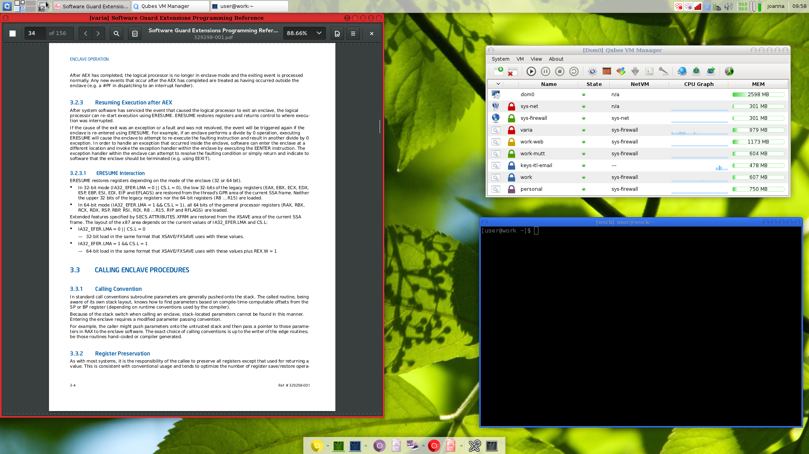

<!-- $size: 16:9 -->
<!-- page_number: false -->
<span style="float:right;"> </span>

#
#
#
#

# Compartmentalization
## Dividing our digital life to increase privacy


#
#
#
#
#

<span style="float:left;">[](http://creativecommons.org/licenses/by-sa/4.0/)</span>
<!-- Creative Commons Attribution-ShareAlike -->

---
#
#
#
#
#

# <center>Sharing is Caring </center>
*<center>Please copy, share, and remix!</center>*
#
#
<center> grab a copy of the presentation: 
  
[github.com/francisco-core/presentation-compartmentalization](https://github.com/francisco-core/presentation-compartmentalization)
###### The file `presentation.md` includes additional notes
</center>


#
#
<span style="float:left;">[](http://creativecommons.org/licenses/by-sa/4.0/)</span>
<!-- Creative Commons Attribution-ShareAlike -->&nbsp;  This presentation is under the Creative Commons Attribution-ShareAlike License

----
<!-- page_number: true -->
<!-- Motivation -->
<span style="float:right;"> </span>
#
#
#
#
# Don't put all your eggs 
# in one basket


---


# <span style="float:left;"> centralized </span><span style="float:right;">  compartmentalized</span>
<br>

<span style="float:left;"></span><span style="float:right;"> </span>
<br>
<span style="float:left;margin-left:4%">Easier to guard </span><span style="float:right;margin-right:4%">  Harder to manage</span>
<br>

### <span style="float:left;margin-left:3%">Easier to break </span><span style="float:right;margin-right:3%"> Tougher to break</span>

---

# How to compartmentalize?

1. Planing ahead
2. Practice what you planed


---
# Some terminology
to make things easer

---

# Domain

What we call each basket. As in *domain* of your life
#
<!--- this is what we'll call each compartment--->
E.g. Personal, Work, Banking, etc.
#

> **tip:** Use colors to help you identify each one

---


# 1.  Make a plan
#
|  Domain  | color       | Uses |
|:--------:|:-----------:|:----:|
| *personal* |<span style="background-color:orange"> &nbsp; &nbsp; orange &nbsp; &nbsp;  </span>|  visiting websites in perosonal account   |   
| *work* | <span style="background-color:turquoise">&nbsp; &nbsp; turquoise &nbsp;&nbsp;  </span>| anything related to work|
| *banking* | <span style="background-color:lightgreen">&nbsp;&nbsp;  green &nbsp;&nbsp;  </span> | for online banking only
| *untrusted* | <span style="background-color:red">&nbsp;&nbsp;  red &nbsp;&nbsp;  </span> | anything that does not fit the orther categories


#
> **tip:** make sure the colors have a meaning to you (e.g. green as safe)

---

# 2. Practice

1. Different logins (with the help of your passord manager)
2. Fake logins
3. Different service provider
4. Different browsers
5. Different phones (work and personal)

---

# Password Managers

```

├── personal
│   ├── email
│   └── reddit
│ 
├── work
│   ├── email
│   └── other-work-logins
│ 
└── banking

```
#
> **Tip:** organization here is important. It's really easy be have a huge mess
> And with mess comes insecurity

---

# Firefox Containers    -   Demo
<!-- SUGGESTION TO PRESENTER -->
<!-- At this point, you stop the slides presentation and show a demo on how people can have
various account on the same browser logged in at the same time. You could also show people how
they can use the extention for more usefull stuff like hiding all tabs from one identity and
picking the up later, opening in a container by default, etc ---->


> **warning:** firefox contaniers helps you privacy-wise in the sense that it allows you to manage various accounts at the same time. It **does not** protect against fingerprinting.
> For that, you should be using *Tor Borwser*

---

### Ultimate Compartmentalization:

# Anonymity

Efemeral and unconnected compartments

<!-- SUGGESTION TO PRESENTER --> <!-- with torbrowser you navigate
anonymously. It's as though every website you visited was in its own
little compartment which gets thown away after you close it. So,
unless you log into to any services, you actions there will be
disconnected from any other compartment of yours-->

---

# Torbrowser - Demo

<!-- SUGGESTION TO PRESENTER -->
<!-- Here the tor browser can be shown. Teach people a few bullet points on why it can help with
protecting their privacy (out of the scope of this presentation, but important for those
unfamiliar. The demo how people can use a "new identity" - which clears the cookies rebuilds 
used circuits-->


# 
To switch identities you press the onion button in top left corner and it will restart your browser.

---

# Temporary Accounts
Not all eggs deserve a basket

<!-- SUGGESTION TO PRESENTER -->
<!-- Here you can demo how one can login to a website without having to create an account.
Mention to people that this way it is much faster, works most of the times and they don't need
to give up personal information -->

| | |
|:---------------------------:|:-:|
| bugmenot.com |login2.me|
#
> **Tip:** Only login with an account of yours when you really need to

---

# Various Computers
#

<span style="float:left;"> </span><span style="float:right;"> </span>
<br>
<br>
<br>
## QubesOS
#

<!-- SUGGESTION TO PRESENTER -->
<!-- If you are familiar with Qubes, please show the basics of how it works in practice.
I would suggest taking a look at Micah Lee's presentation: "Qubes OS: The Operating System That Can Protect You Even If You Get Hacked" (https://www.qubes-os.org/video-tours/#micah-lee-presents-qubes-os-the-operating-system-that-can-protec) and doing a 5 minute demo. -->
